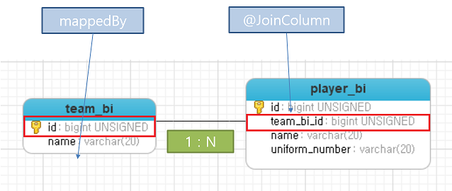
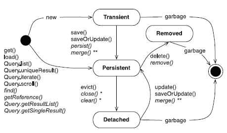

# Sample Project for Spring Data Jpa

## application.properties
[참고](https://creatorpark-tech-stack.tistory.com/2?category=812808)

## Concepts
### Source/Target Entity
  

Target Entity  
- (FK) non-owning side (Parent Entity)  
- Target Entity는 Main Entity이다.
- Source Entity는 FK의 관리 주체를 말하는 것이지, Parent(Main) Entity는 아니다. 매우 헤깔린다.    
- mappedBy(상대편(Source Entity에 있는 자기의 필드명, 예제에서는 team) 속성을 적는다.
  
```java
@Entity
public class TeamBi implements Serializable {
	
	@OneToMany(fetch = FetchType.EAGER, cascade = CascadeType.ALL, mappedBy="team")
	private List<PlayerBi> players = new ArrayList<PlayerBi>();
```

Source Entity
- (FK) owning side (Child Entity)  
- FK필드를 소유,저장 및 관리하는 Entity를 말한다.  
- @JoinColumn(name=FK(DB의칼럼명)를 적는다.)

```java
@Entity
public class PlayerBi implements Serializable {
	
	@JoinColumn(name="team_bi_id")
	@ManyToOne()
	private TeamBi team = new TeamBi();
```

### CASCADE
- CASCADE는 CUD에 영향을 준다.
- Parent Entity를 저장할 때 Child Entity를 어디까지 영향권에 둘지(Cascade) 설정한다.
- EntityManager가 관리하는 Entity Life Cycle과 관련이 있다.  
  
- 1:1 관계 - Cascade.ALL  
- 1:N 관계 - Cascade.ALL  
- M:N 관계 - CascadeType.PERSIST, CascadeType.MERGE

[참고](https://vladmihalcea.com/a-beginners-guide-to-jpa-and-hibernate-cascade-types/)
  
### FETCH - EAGER, LAZY
- FETCH는 R에 영향을 준다.
- Parent Entity를 불러올 때,  
Child Entity를 바로 가져 올 것인가(EAGER)?  
Child Entity를 호출하는 시점에 불러 올 것인가?
- JPA 기본 전략  (x:1 관계 -> Eager) (x:N 관계 -> Lazy)
- 1:1 관계 - Fetch.Eager
- 1:N 관계 - Fetch.Lazy
- N:1 관계 - Fetch.Eager 
- M:N 관계 - Fetch.Lazy
[참고](https://vladmihalcea.com/initialize-lazy-proxies-collections-jpa-hibernate/)

## Relation

### @OneToOne   
- 1:1 PK는 SELECT에서 INDEX를 한쪽만 타기 때문에 1:1 FK보다 50% 성능이 좋다.[참고](https://vladmihalcea.com/the-best-way-to-map-a-onetoone-relationship-with-jpa-and-hibernate/)
- 1:1 에서는 INNER JOIN 과 LEFT JOIN 되고 안되고 차이를 분석하는게 이슈[참고](https://chanlee.wordpress.com/2012/07/04/jpa-%EC%A1%B0%EC%9D%B8%ED%8C%81-inner-or-outer-join/)  
- [참고](https://kwonnam.pe.kr/wiki/java/jpa/one-to-one)

### @OneToMany
-  One쪽이 Parent(Target) Entity이다.
- Many쪽이 Source(Child) Entity이다. 
- 1:N 단방향의 성능 저하 현상 
[참고](https://vladmihalcea.com/the-best-way-to-map-a-onetomany-association-with-jpa-and-hibernate/)
- JPA 1:N JOIN은 Spring Data @Query가 아닌 JPQL을 직접 해서 작성해야 작동한다.  
 [참고](https://stackoverflow.com/questions/12465260/jpa-hibernate-inner-join-between-parent-and-child-tables)

### @ManyToOne
- 1:N 관계에서 양방향 관계를 맺고, Child(Source) Entity에 적는다. 

### @ManyToMany
- @ManyToMany 관계는 두 Entity의 JOIN관계를 저장하는 Join Table을 사용한다.  
  
Source Entity
- @JoinTable을 적고, joinColumns에 Join Table에서 참조하는 FK를 적는다.
- 반대편 객체는 다른 곳에서 사용될 수 있기 때문에 CascadeType이 ALL이 아닌 것에 주의한다.  

```java
@ManyToMany(cascade = { CascadeType.PERSIST, CascadeType.MERGE })
@JoinTable(name = "post_tag_details", 
        joinColumns = @JoinColumn(name = "post_id"), 
 inverseJoinColumns = @JoinColumn(name = "tag_id"))
private Set<Tag> tags = new HashSet<>();
```

Target Entity  
- mappedBy 속성을 적는다. 
- 참조만 가능하다.
  
```java
@ManyToMany(mappedBy="tags")
private Set<Post> posts = new HashSet<>();
```

### Entity Graph
https://blog.leocat.kr/notes/2019/05/26/spring-data-using-entitygraph-to-customize-fetch-graph


